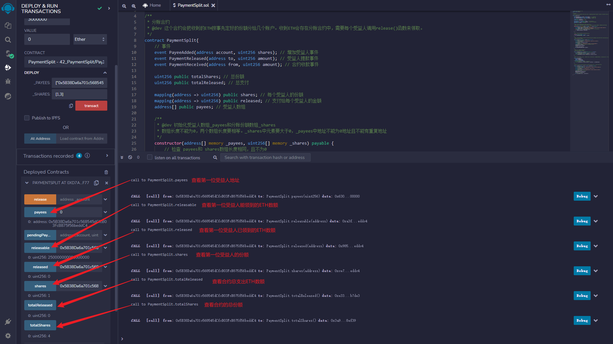
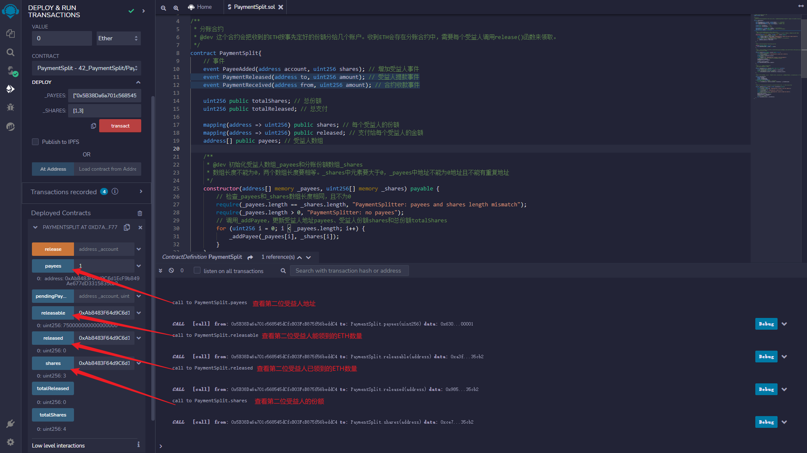
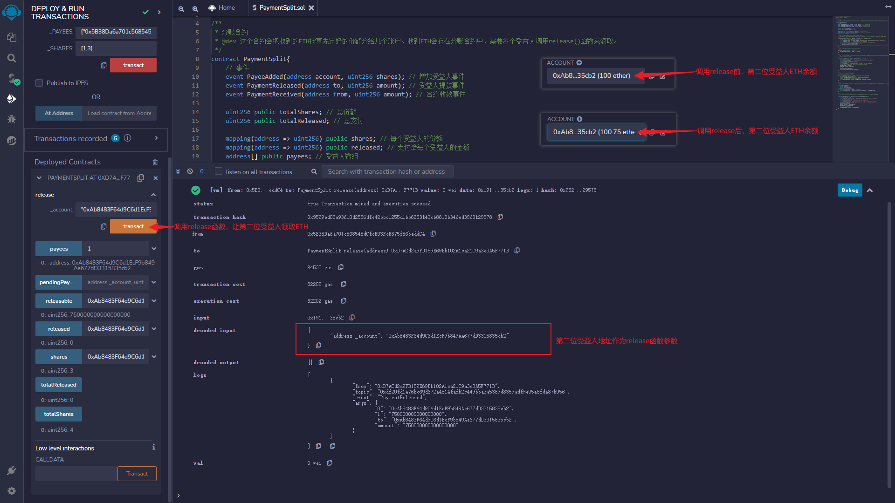
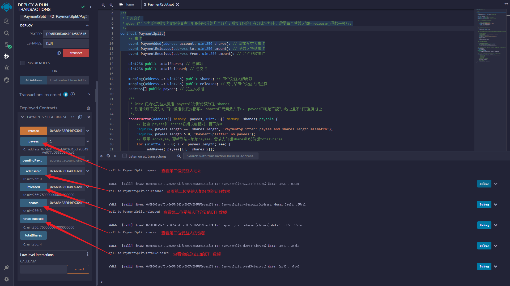

# WTF Solidity Simplified: 42. Divisão de Pagamentos

Recentemente, tenho revisado meus conhecimentos em solidity, consolidando detalhes e escrevendo um "WTF Solidity Simplified" para ajudar iniciantes (os mestres da programação podem procurar por outros tutoriais). Atualizações semanais com 1-3 lições.

Twitter: [@0xAA_Science](https://twitter.com/0xAA_Science)

Discord: [WTF Academy](https://discord.gg/5akcruXrsk)

Todo o código e tutoriais são de código aberto no GitHub: [github.com/AmazingAng/WTFSolidity](https://github.com/AmazingAng/WTF-Solidity)

---

Nesta lição, apresentaremos o contrato de divisão de pagamentos, que permite distribuir `ETH` para um grupo de contas de acordo com pesos predefinidos. O código é uma simplificação do contrato PaymentSplitter da biblioteca OpenZeppelin.

## Divisão de Pagamentos

Dividir pagamentos significa distribuir fundos de acordo com uma proporção específica. Na vida real, é comum ocorrer situações em que a divisão não é justa; porém, no mundo blockchain, onde "o Código é a Lei", podemos definir as proporções de cada pessoa em um contrato inteligente antes de recebermos um pagamento e, então, o contrato inteligente faz a divisão dos recursos.


## Contrato de Divisão de Pagamentos

O contrato de divisão de pagamentos (`PaymentSplit`) tem as seguintes características:

1. Ao criar o contrato, é necessário especificar os beneficiários `payees` e a quantidade de participação de cada um `shares`.
2. As participações podem ser iguais ou qualquer outra proporção desejada.
3. Todas as `ETH` recebidas por este contrato serão distribuídas a cada beneficiário de acordo com a proporção de sua participação.
4. O contrato de divisão de pagamentos segue o modelo de `Pull Payment` - os pagamentos não são feitos automaticamente para as contas, mas sim mantidos no contrato. Os beneficiários podem solicitar o pagamento chamando a função `release()`.

```solidity
// SPDX-License-Identifier: MIT
pragma solidity ^0.8.21;

/**
 * Contrato de Divisão de Pagamentos
 * @dev Este contrato irá distribuir os ETH recebidos para várias contas de acordo com as proporções predefinidas. Os ETH recebidos serão mantidos neste contrato e os beneficiários precisam chamar a função release() para resgatá-los.
 */
contract PaymentSplit {
```

### Eventos

O contrato de divisão de pagamentos possui `3` eventos:

- `PayeeAdded`: evento de adição de beneficiário.
- `PaymentReleased`: evento de pagamento liberado para o beneficiário.
- `PaymentReceived`: evento de recebimento de pagamento pelo contrato de divisão.

```solidity
    // Eventos
    event PayeeAdded(address account, uint256 shares); // Evento de adição de beneficiário
    event PaymentReleased(address to, uint256 amount); // Evento de pagamento liberado para beneficiário
    event PaymentReceived(address from, uint256 amount); // Evento de recebimento de pagamento pelo contrato
```

### Variáveis de Estado

O contrato de divisão de pagamentos possui `5` variáveis de estado, que registram endereços de beneficiários, participações, `ETH` pagos, entre outras informações:

- `totalShares`: quantidade total de participações, que corresponde à soma das `shares`.
- `totalReleased`: quantidade total de `ETH` pagos aos beneficiários, correspondendo à soma dos valores distribuídos.
- `payees`: array de endereços, que registra os beneficiários.
- `shares`: mapeamento de endereços para integers, que armazena as participações de cada beneficiário.
- `released`: mapeamento de endereços para integers, que armazena os valores de `ETH` pagos a cada beneficiário.

```solidity
    uint256 public totalShares; // Total de participações
    uint256 public totalReleased; // Total de pagamentos feitos

    mapping(address => uint256) public shares; // Participações de cada beneficiário
    mapping(address => uint256) public released; // Valores pagos a cada beneficiário
    address[] public payees; // Array de beneficiários
```

### Funções

O contrato de divisão de pagamentos possui `6` funções:

- Construtor: inicializa os arrays de beneficiários `_payees` e de participações `_shares`, sendo o comprimento dos arrays diferente de zero e iguais entre si. As participações devem ser maiores que zero, e os endereços dos beneficiários não podem ser nulos nem repetidos.
- `receive()`: função de callback que emite o evento `PaymentReceived` quando o contrato de divisão recebe `ETH`.
- `release()`: função de divisão de pagamentos, que distribui os `ETH` para um endereço de beneficiário válido `_account`. Qualquer pessoa pode chamar essa função, mas os fundos serão enviados diretamente para o endereço do beneficiário. Ela chama a função `releasable()`.
- `releasable()`: calcula a quantidade de `ETH` que um endereço de beneficiário pode resgatar. Chama a função `pendingPayment()`.
- `pendingPayment()`: calcula a quantidade de `ETH` que um beneficiário pode receber, com base no endereço do beneficiário `_account`, na receita total do contrato `_totalReceived` e nos pagamentos já efetuados para esse endereço `_alreadyReleased`.
- `_addPayee()`: função para adicionar um novo beneficiário e sua participação. Só pode ser chamada no construtor e não pode ser modificada posteriormente.

```solidity
    /**
     * @dev Inicializa os arrays de beneficiários (_payees) e de participações (_shares). O comprimento dos arrays deve ser diferente de zero e iguais entre si. As participações devem ser maiores que zero, e os endereços dos beneficiários não podem ser nulos nem repetidos.
     */
    constructor(address[] memory _payees, uint256[] memory _shares) payable {
        // Verifica se os arrays _payees e _shares possuem o mesmo comprimento
        require(_payees.length == _shares.length, "PaymentSplitter: payees and shares length mismatch");
        require(_payees.length > 0, "PaymentSplitter: no payees");
        // Chama _addPayee para atualizar os endereços de beneficiários (payees), as participações de beneficiários (shares) e o total de participações (totalShares)
        for (uint256 i = 0; i < _payees.length; i++) {
            _addPayee(_payees[i], _shares[i]);
        }
    }

    /**
     * @dev Função de callback para quando o contrato de divisão recebe ETH, emitindo o evento PaymentReceived.
     */
    receive() external payable virtual {
        emit PaymentReceived(msg.sender, msg.value);
    }

    /**
     * @dev Para dividir fundos para um endereço de beneficiário válido _account. Qualquer um pode chamar, mas os fundos são enviados diretamente para o endereço do beneficiário.
     * Chama a função releasable().
     */
    function release(address payable _account) public virtual {
        // O endereço deve ser um beneficiário válido
        require(shares[_account] > 0, "PaymentSplitter: account has no shares");
        // Calcula o pagamento devido ao endereço
        uint256 payment = releasable(_account);
        // Verifica se o pagamento é maior que zero
        require(payment != 0, "PaymentSplitter: account is not due payment");
        // Atualiza total de pagamentos e os pagamentos feitos a cada beneficiário
        totalReleased += payment;
        released[_account] += payment;
        // Transfere os fundos
        _account.transfer(payment);
        emit PaymentReleased(_account, payment);
    }

    /**
     * @dev Calcula a quantidade de ETH que um beneficiário pode resgatar.
     * Chama a função pendingPayment().
     */
    function releasable(address _account) public view returns (uint256) {
        // Calcula a receita total do contrato
        uint256 totalReceived = address(this).balance + totalReleased;
        // Chama pendingPayment para calcular a quantidade de ETH devida ao endereço
        return pendingPayment(_account, totalReceived, released[_account]);
    }

    /**
     * @dev Calcula a quantidade de ETH que um beneficiário pode resgatar, com base no endereço do beneficiário _account, na receita total do contrato _totalReceived e nos pagamentos já efetuados para esse endereço _alreadyReleased.
     */
    function pendingPayment(
        address _account,
        uint256 _totalReceived,
        uint256 _alreadyReleased
    ) public view returns (uint256) {
        // Quantidade de ETH devida = (receita total * participação do beneficiário) / total de participações - valor já pago
        return (_totalReceived * shares[_account]) / totalShares - _alreadyReleased;
    }

    /**
     * @dev Adiciona um novo beneficiário _account e a sua participação _accountShares. Só pode ser chamado durante a construção do contrato e não pode ser alterado posteriormente.
     */
    function _addPayee(address _account, uint256 _accountShares) private {
        // Verifica se o endereço não é nulo
        require(_account != address(0), "PaymentSplitter: account is the zero address");
        // Verifica se a participação não é zero
        require(_accountShares > 0, "PaymentSplitter: shares are 0");
        // Verifica se o endereço do beneficiário é único
        require(shares[_account] == 0, "PaymentSplitter: account already has shares");
        // Atualiza payees, shares e totalShares
        payees.push(_account);
        shares[_account] = _accountShares;
        totalShares += _accountShares;
        // Emite o evento de adição do beneficiário
        emit PayeeAdded(_account, _accountShares);
    }
```

## Demonstração no `Remix`

### 1. Implantação do contrato de divisão de pagamentos `PaymentSplit` e transferência de `1 ETH`

No construtor, insira dois endereços de beneficiários, com participações de `1` e `3`.


### 2. Visualização de endereços de beneficiários, participações, e quantidade de `ETH` a receber





### 3. Chamada da função para receber `ETH`



### 4. Visualização das mudanças nos totais de pagamento, saldo dos beneficiários e quantidade de `ETH` a receber



## Conclusão

Nesta lição, apresentamos o contrato de divisão de pagamentos. No mundo blockchain, onde "o Código é a Lei", podemos definir as proporções de cada pessoa em um contrato inteligente antes de recebermos um pagamento e, então, o contrato inteligente faz a divisão dos recursos, evitando assim problemas de "divisão injusta de receitas".

