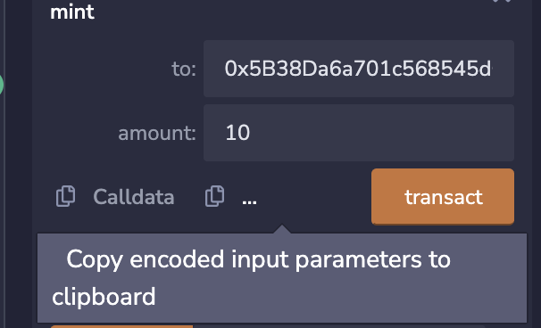

# WTF Introdução Simples ao Solidity: 55. Chamadas Múltiplas

Recentemente, tenho revisitado meus estudos sobre solidity para reforçar alguns detalhes e estou escrevendo um "WTF Introdução Simples ao Solidity", para ajudar os novatos (programadores experientes podem procurar outros tutoriais). Atualizo de 1 a 3 lições por semana.

Twitter: [@0xAA_Science](https://twitter.com/0xAA_Science)

Comunidades: [Discord](https://discord.gg/5akcruXrsk)｜[Grupo no WeChat](https://docs.google.com/forms/d/e/1FAIpQLSe4KGT8Sh6sJ7hedQRuIYirOoZK_85miz3dw7vA1-YjodgJ-A/viewform?usp=sf_link)｜[Site oficial wtf.academy](https://wtf.academy)

Todo o código e tutoriais estão disponíveis no Github: [github.com/AmazingAng/WTFSolidity](https://github.com/AmazingAng/WTF-Solidity)

---

Nesta lição, vamos falar sobre o contrato MultiCall, que permite a execução de várias chamadas de função em uma única transação, reduzindo significativamente as taxas e aumentando a eficiência.

## MultiCall

No Solidity, o contrato MultiCall permite que façamos várias chamadas de função em uma única transação. Suas vantagens incluem:

1. Facilidade: o MultiCall permite a execução de chamadas de função em diferentes contratos com diferentes parâmetros em uma única transação. Por exemplo, você pode consultar o saldo de várias contas de tokens ERC20 de uma vez.

2. Economia de gas: o MultiCall combina várias transações em múltiplas chamadas de função em uma única transação, reduzindo assim o consumo de gas.

3. Atomicidade: o MultiCall permite que os usuários executem todas as operações em uma transação, garantindo que todas as operações sejam concluídas com sucesso ou que nenhuma delas seja concluída. Isso mantém a atomicidade das operações. Por exemplo, você poderia realizar uma série de transações de tokens em uma ordem específica.

## Contrato MultiCall

Vamos analisar o contrato MultiCall, que é uma simplificação do contrato MultiCall do MakerDAO.

O contrato MultiCall define duas estruturas:

- `Call`: esta é uma estrutura de chamada que contém o contrato alvo `target`, uma flag para permitir falhas `allowFailure` e os dados da chamada `callData`.

- `Result`: esta é uma estrutura de resultado que indica se a chamada teve sucesso `success` e os dados de retorno `returnData`.

O contrato possui apenas uma função, que é usada para executar chamadas múltiplas:

- `multicall()`: esta função recebe um array de estruturas Call e executa as várias chamadas em um loop, revertendo a transação se uma chamada falhar.

```solidity
// SPDX-License-Identifier: MIT
pragma solidity ^0.8.19;

contract Multicall {
    struct Call {
        address target;
        bool allowFailure;
        bytes callData;
    }

    struct Result {
        bool success;
        bytes returnData;
    }

    function multicall(Call[] calldata calls) public returns (Result[] memory returnData) {
        uint256 length = calls.length;
        returnData = new Result[](length);
        Call calldata calli;
        
        for (uint256 i = 0; i < length; i++) {
            Result memory result = returnData[i];
            calli = calls[i];
            (result.success, result.returnData) = calli.target.call(calli.callData);
            if (!(calli.allowFailure || result.success)){
                revert("Multicall: call failed");
            }
        }
    }
}
```

## Implementação no Remix

1. Primeiro, deploy um contrato ERC20 básico `MCERC20` e anote o endereço do contrato.

2. Deploy o contrato `MultiCall`.

3. Obtenha os `calldata` para as chamadas. Vamos criar tokens para 2 endereços, um com 50 tokens e outro com 100 tokens. No Remix, você pode preencher os parâmetros da função `mint()` e clicar no botão **Calldata** para obter o `calldata` codificado. Exemplo:

    ```solidity
    to: 0x5B38Da6a701c568545dCfcB03FcB875f56beddC4
    amount: 50
    calldata: 0x40c10f190000000000000000000000005b38da6a701c568545dcfcb03fcb875f56beddc40000000000000000000000000000000000000000000000000000000000000032
    ```

    

    Se não conhece o `calldata`, leia a [Leção 29] do WTF Solidity.

4. Use a função `multicall()` do `MultiCall` para chamar a função `mint()` do contrato ERC20 e emitir 50 tokens para um endereço e 100 tokens para outro. Exemplo:

    ```solidity
    calls: [["0x0fC5025C764cE34df352757e82f7B5c4Df39A836", true, "0x40c10f190000000000000000000000005b38da6a701c568545dcfcb03fcb875f56beddc40000000000000000000000000000000000000000000000000000000000000032"], ["0x0fC5025C764cE34df352757e82f7B5c4Df39A836", false, "0x40c10f19000000000000000000000000ab8483f64d9c6d1ecf9b849ae677dd3315835cb20000000000000000000000000000000000000000000000000000000000000064"]]
    ```

5. Use a função `multicall()` do `MultiCall` para chamar a função `balanceOf()` do contrato ERC20 e verificar os saldos dos endereços que foram criados anteriormente. O seletor da função `balanceOf()` é `0x70a08231`. Exemplo:

    ```solidity
    [["0x0fC5025C764cE34df352757e82f7B5c4Df39A836", true, "0x70a082310000000000000000000000005b38da6a701c568545dcfcb03fcb875f56beddc4"], ["0x0fC5025C764cE34df352757e82f7B5c4Df39A836", false, "0x70a08231000000000000000000000000ab8483f64d9c6d1ecf9b849ae677dd3315835cb2"]]
    ```

Você pode verificar os valores de retorno das chamadas na seção "decoded output". Os saldos das duas contas são `0x0000000000000000000000000000000000000000000000000000000000000032` e `0x0000000000000000000000000000000000000000000000000000000000000064`, o que significa 50 e 100, respectivamente. A chamada foi bem-sucedida!

## Conclusão
Nesta lição, aprendemos sobre o contrato MultiCall, que permite executar várias chamadas de função em uma única transação. É importante observar que diferentes contratos MultiCall podem ter diferentes parâmetros e lógica de execução, portanto, é importante ler cuidadosamente o código-fonte antes de usá-los.

<!-- This file was translated using AI by repo_ai_translate. For more information, visit https://github.com/marcelojsilva/repo_ai_translate -->