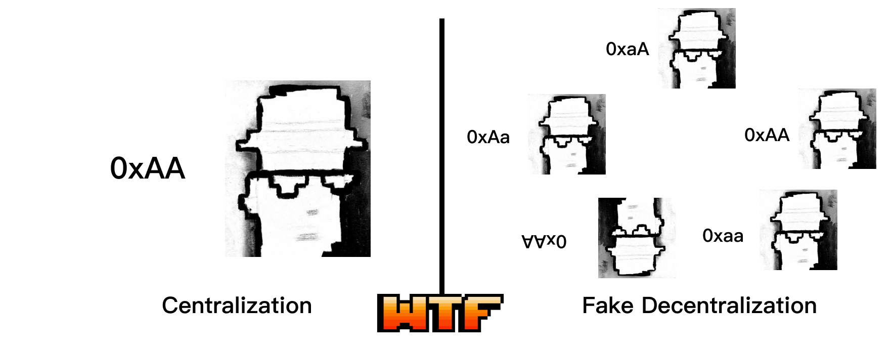

# S03. Risco de centralização

Recentemente, tenho estudado Solidity novamente para consolidar os detalhes e escrever um "WTF Solidity Guia Rápido" para iniciantes (os especialistas em programação podem procurar outros tutoriais), atualizando de 1 a 3 lições por semana.

Twitter: [@0xAA_Science](https://twitter.com/0xAA_Science) | [@WTFAcademy\_](https://twitter.com/WTFAcademy_)

Comunidade: [Discord](https://discord.gg/5akcruXrsk) | [Grupo do WhatsApp](https://docs.google.com/forms/d/e/1FAIpQLSe4KGT8Sh6sJ7hedQRuIYirOoZK_85miz3dw7vA1-YjodgJ-A/viewform?usp=sf_link) | [Site oficial wtf.academy](https://wtf.academy)

Todo o código e tutorial são de código aberto no github: [github.com/AmazingAng/WTFSolidity](https://github.com/AmazingAng/WTF-Solidity)

---

Nesta lição, vamos abordar os riscos de centralização e pseudo descentralização em contratos inteligentes. A ponte `Ronin` e a ponte `Harmony` foram hackeadas devido a essa vulnerabilidade, resultando no roubo de 624 milhões de dólares e 100 milhões de dólares, respectivamente.

## Risco de Centralização

Muitas vezes nos orgulhamos da descentralização do Web3, acreditando que, no mundo do Web3.0, a propriedade e o controle são descentralizados. No entanto, a centralização é um dos riscos mais comuns em projetos Web3. A empresa de auditoria blockchain Certik afirmou em seu [Relatório de Segurança DeFi de 2021](https://f.hubspotusercontent40.net/hubfs/4972390/Marketing/defi%20security%20report%202021-v6.pdf):

> O risco de centralização é a vulnerabilidade mais comum do DeFi, com 44 ataques de hackers relacionados a ele em 2021, resultando em perdas de fundos para os usuários superiores a 1,3 bilhão de dólares. Isso destaca a importância da descentralização; muitos projetos ainda precisam trabalhar para alcançar esse objetivo.

Risco de centralização refere-se a contratos inteligentes nos quais a propriedade é centralizada, com um endereço (como `owner`) controlando o contrato e podendo modificar parâmetros, até mesmo retirar fundos dos usuários. Projetos centralizados possuem risco de ponto único de falha e podem ser explorados por desenvolvedores maliciosos (insiders) ou hackers que obterem a chave privada do endereço de controle para realizar ações como `rug-pull`, minting infinito, ou outras formas de roubo.

O projeto de jogos blockchain `Vulcan Forged` foi hackeado em dezembro de 2021, resultando no roubo de 140 milhões de dólares. O projeto DeFi `EasyFi` foi hackeado em abril de 2021, resultando no roubo de 59 milhões de dólares devido a uma chave privada vazada. O projeto DeFi `bZx` foi vítima de um ataque de phishing que resultou em um roubo de 55 milhões de dólares devido à chave privada vazada. 

## Risco de Pseudo Descentralização

Projetos de pseudo descentralização muitas vezes se autoproclamam descentralizados, mas na realidade possuem o mesmo risco de ponto único de falha que os projetos centralizados. Por exemplo, ao usar uma carteira multi-assinatura para gerenciar o contrato inteligente, mas com várias pessoas na multi-assinatura agindo de forma coordenada e controlada por uma pessoa. Esses projetos podem ganhar a confiança dos investidores por parecerem muito descentralizados, então quando ocorrem eventos de hackers, o valor roubado tende a ser maior.

A ponte cruzada `Ronin` da popular jogo blockchain Axie foi hackeada em março de 2022, resultando no roubo de 624 milhões de dólares, o maior roubo da história. A ponte Ronin era mantida por 9 validadores, sendo necessário o consenso de 5 deles para aprovar transações de depósito e retirada. Parecia ser uma solução de multi-assinatura muito descentralizada. Mas na verdade, 4 dos validadores eram controlados pela empresa de desenvolvimento do Axie, Sky Mavis. E 1 validador controlado pelo Axie DAO também aprovou os nós de validação da Sky Mavis para assinar transações em seu nome. Assim, após um atacante obter a chave privada da Sky Mavis (método exato não divulgado), poderia controlar 5 nós de validação e autorizar o roubo de 173.600 ETH e 25,5 milhões de USDC. Além disso, em 1º de agosto de 2023, a carteira multi-assinatura do PEPE alterou seu limiar de `5/8` para apenas `2/8` e transferiu uma grande quantidade de PEPE da carteira multi-assinatura, mais um exemplo de pseudo descentralização.

A ponte cruzada da `Harmony` na rede Harmony foi hackeada em junho de 2022, resultando no roubo de 100 milhões de dólares. A ponte Harmony era controlada por 5 pessoas em uma carteira multi-assinatura de forma bastante questionável, pois bastava a assinatura de 2 delas para aprovar uma transação. Quando o hacker conseguiu obter as chaves privadas de duas pessoas da multi-assinatura, ele pôde esvaziar os ativos depositados pelos usuários.



## Exemplo de contratos vulneráveis

Há uma variedade de contratos que apresentam riscos de centralização, aqui está apenas um exemplo comum: um contrato de `ERC20` onde o endereço `owner` pode emitir tokens arbitrariamente. Quando um insider ou hacker obtém a chave privada do `owner`, ele pode criar tokens infinitos, resultando em grandes perdas para os investidores.

```solidity
// SPDX-License-Identifier: MIT
pragma solidity ^0.8.21;

import "@openzeppelin/contracts/token/ERC20/ERC20.sol";
import "@openzeppelin/contracts/access/Ownable.sol";

contract Centralization is ERC20, Ownable {
    constructor() ERC20("Centralization", "Cent") {
        address exposedAccount = 0xe16C1623c1AA7D919cd2241d8b36d9E79C1Be2A2;
        transferOwnership(exposedAccount);
    }

    function mint(address to, uint256 amount) external onlyOwner{
        _mint(to, amount);
    }
}
```

## Como reduzir o risco de centralização/pseudo descentralização?

1. Utilize carteiras multi-assinatura para gerenciar o tesouro e controlar os parâmetros do contrato. Para equilibrar eficiência e descentralização, você pode escolher uma multi-assinatura 4/7 ou 6/9. Se você não está familiarizado com carteiras multi-assinatura, consulte [WTF Solidity Lesson 50: Multi-Signature Wallet](../50_MultisigWallet/readme_pt-br.md).

2. Diversifique os proprietários da multi-assinatura, distribuindo entre a equipe fundadora, investidores e líderes comunitários, e não autorize ações de assinatura mútua. 

3. Utilize contratos de bloqueio de tempo para controlar o contrato, dando tempo para a equipe do projeto e comunidade reagirem a modificações maliciosas/roubos de ativos, minimizando as perdas. Se não tiver conhecimento sobre contratos de bloqueio de tempo, leia [WTF Solidity Lesson 45: Timelock](../45_Timelock/readme_pt-br.md).

## Conclusão

A centralização/pseudo descentralização representa o maior risco para projetos blockchain, resultando em perdas de fundos para usuários acima de 2 bilhões de dólares nos últimos dois anos. A centralização de riscos pode ser identificada analisando o código do contrato, enquanto os riscos de pseudo descentralização são mais difíceis de detectar e requerem uma diligência aprofundada do projeto para serem descobertos.

