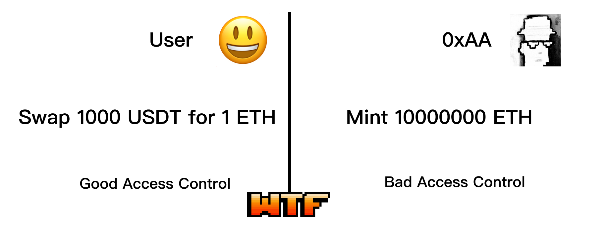

# WTF Solidity Contract Security: S04. Vulnerabilidade na Gestão de Permissões

Recentemente tenho revisado meus conhecimentos em solidity para reforçar os detalhes, e estou escrevendo um "WTF Solidity Introdução Simplificada" para iniciantes (programadores experientes podem procurar outros tutoriais), com atualizações semanais de 1 a 3 aulas.

Twitter: [@0xAA_Science](https://twitter.com/0xAA_Science) | [@WTFAcademy_](https://twitter.com/WTFAcademy_)

Comunidade: [Discord](https://discord.gg/5akcruXrsk) | [Grupo no WeChat](https://docs.google.com/forms/d/e/1FAIpQLSe4KGT8Sh6sJ7hedQRuIYirOoZK_85miz3dw7vA1-YjodgJ-A/viewform?usp=sf_link) | [Site oficial wtf.academy](https://wtf.academy)

Todo o código e tutoriais são de código aberto no github: [github.com/AmazingAng/WTFSolidity](https://github.com/AmazingAng/WTFSolidity)

---

Nesta aula, vamos abordar a vulnerabilidade na gestão de permissões em contratos inteligentes. Esta vulnerabilidade resultou no hack de US$ 6,11 bilhões na rede Poly Network e causou um hack de US$ 300.000 no projeto DeFi ShadowFi na BSC.

## Vulnerabilidade na Gestão de Permissões

A gestão de permissões em contratos inteligentes define as diferentes permissões dos diversos papéis na aplicação. Normalmente, funções como a cunhagem de tokens, a movimentação de fundos e a suspensão de operações requerem usuários com permissões mais elevadas para serem acionadas. Se as permissões forem configuradas incorretamente, isso pode resultar em perdas inesperadas. Abaixo, vamos abordar dois tipos comuns de vulnerabilidades na gestão de permissões.

### 1. Erros na Configuração de Permissões

Se funções especiais no contrato não tiverem uma gestão de permissões adequada, qualquer pessoa poderá cunhar grandes quantidades de tokens ou esvaziar os fundos do contrato. O contrato do Poly Network, que permite a transferência de guardiões, não tinha a configuração de permissões apropriada, o que permitiu que um hacker alterasse o seu próprio endereço como guardião, permitindo a retirada de US$ 6,11 bilhões do contrato.

No código abaixo, a função `mint()` não tem uma gestão de permissões, o que significa que qualquer pessoa pode acioná-la para cunhar tokens.

```solidity
// Função mint incorreta sem restrição de permissões
function badMint(address to, uint amount) public {
    _mint(to, amount);
}
```



### 2. Falha na Verificação de Autorização

Outro tipo comum de vulnerabilidade na gestão de permissões é a falta de verificação do autorizador em uma função. O contrato de token do ShadowFi na BSC esqueceu de verificar a autorização do saldo de um endereço na função `burn()`, permitindo que um atacante destruísse tokens de outros endereços. Após destruir os tokens na piscina de liquidez, o atacante poderia vender alguns tokens e depois retirar todo o `BNB` da piscina, lucrando US$ 300.000.

```solidity
// Função burn incorreta sem restrição de permissões
function badBurn(address account, uint amount) public {
    _burn(account, amount);
}
```


## Medidas de Prevenção

As vulnerabilidades na gestão de permissões podem ser prevenidas principalmente de duas formas:

1. Utilizando bibliotecas de gestão de permissões como o OpenZeppelin para configurar as permissões apropriadas para funções especiais do contrato, por exemplo, utilizando o modificador `OnlyOwner` para garantir que apenas o dono do contrato possa acioná-las.

```solidity
// Função mint correta com modificador onlyOwner para limitar permissões
function goodMint(address to, uint amount) public onlyOwner {
    _mint(to, amount);
}
```

2. Verificando se o autorizador possui autorização suficiente na lógica da função.

```solidity
// Função burn correta, que verifica se não é possível queimar tokens de terceiros
function goodBurn(address account, uint amount) public {
    if(msg.sender != account){
        _spendAllowance(account, msg.sender, amount);
    }
    _burn(account, amount);
}
```

## Conclusão

Nesta aula, abordamos a vulnerabilidade na gestão de permissões em contratos inteligentes, que pode se manifestar de duas formas: erros na configuração de permissões e falhas na verificação de autorização. Para evitar essas vulnerabilidades, é importante utilizar bibliotecas de gestão de permissões como o OpenZeppelin para configurar permissões adequadas para funções especiais e verificar se o autorizador possui autorização suficiente na lógica da função.

<!-- This file was translated using AI by repo_ai_translate. For more information, visit https://github.com/marcelojsilva/repo_ai_translate -->