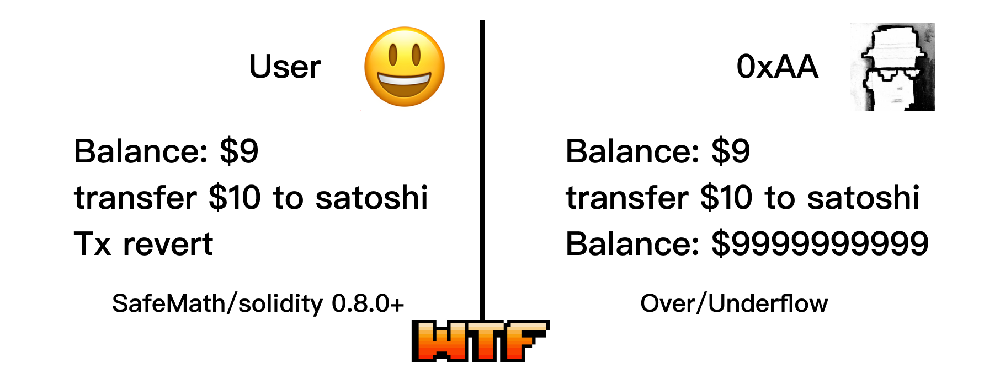

# WTF Contratos Seguros em Solidity: S05. Overflow de Inteiros

Recentemente, tenho revisitado o estudo do Solidity para revisar os detalhes e estou escrevendo um "Guia Simplificado de Introdução ao Solidity" para uso dos iniciantes (os especialistas em programação devem procurar outros tutoriais). Atualizações semanais, de 1 a 3 lições.

Twitter: [@0xAA_Science](https://twitter.com/0xAA_Science) | [@WTFAcademy_](https://twitter.com/WTFAcademy_)

Comunidade: [Discord](https://discord.gg/5akcruXrsk) | [Grupo no WeChat](https://docs.google.com/forms/d/e/1FAIpQLSe4KGT8Sh6sJ7hedQRuIYirOoZK_85miz3dw7vA1-YjodgJ-A/viewform?usp=sf_link) | [Site oficial wtf.academy](https://wtf.academy)

Todo o código e tutoriais estão disponíveis no Github: [github.com/AmazingAng/WTFSolidity](https://github.com/AmazingAng/WTF-Solidity)

-----

Nesta lição, vamos falar sobre a vulnerabilidade de overflow de inteiros (Arithmetic Over/Under Flows). Esta é uma vulnerabilidade clássica, mas a partir da versão 0.8 do Solidity, a biblioteca Safemath está integrada, o que reduz consideravelmente a ocorrência desse tipo de problema.

## Overflow de Inteiros

A Máquina Virtual Ethereum (EVM) possui tamanhos fixos para tipos de dados inteiros, o que significa que ela só pode representar números em determinados intervalos. Por exemplo, o tipo de dados `uint8` só pode representar números no intervalo de [0,255]. Se você atribuir o valor `257` a uma variável do tipo `uint8`, ocorrerá um overflow e o valor será `1`; se você atribuir `-1`, ocorrerá um underflow e o valor será `255`.

Os hackers podem explorar essa vulnerabilidade para promover ataques. Imagine que um hacker tenha um saldo de `0` e, após gastar `$1`, o saldo dele se transforme em `$2^256-1`. Em 2018, o projeto `PoWHC` foi alvo de um ataque e teve `866 ETH` roubados devido a essa vulnerabilidade.



## Exemplo de Contrato com a Vulnerabilidade

O exemplo abaixo é de um contrato simples de token, inspirado em um contrato do Ethernaut. Ele possui `2` variáveis de estado: `balances` para armazenar o saldo de cada endereço e `totalSupply` para guardar o total de tokens em circulação.

Esse contrato possui `3` funções:

- Construtor: inicializa o total de tokens disponíveis.
- `transfer()`: função para transferir tokens.
- `balanceOf()`: função para consultar o saldo.

Como a partir da versão `0.8.0` do Solidity há uma verificação automática de erros de overflow de inteiros, é necessário usar a palavra-chave `unchecked` para desativar temporariamente a verificação de overflow dentro de um bloco de código, como é feito na função `transfer()`.

A vulnerabilidade neste exemplo está na função `transfer()`, onde `require(balances[msg.sender] - _value >= 0);` irá sempre passar devido ao overflow de inteiros, permitindo que os usuários realizem transferências ilimitadas.

```solidity
// SPDX-License-Identifier: MIT
pragma solidity ^0.8.21;

contract Token {
  mapping(address => uint) balances;
  uint public totalSupply;

  constructor(uint _initialSupply) {
    balances[msg.sender] = totalSupply = _initialSupply;
  }
  
  function transfer(address _to, uint _value) public returns (bool) {
    unchecked {
      require(balances[msg.sender] - _value >= 0);
      balances[msg.sender] -= _value;
      balances[_to] += _value;
    }
    return true;
  }
  
  function balanceOf(address _owner) public view returns (uint balance) {
    return balances[_owner];
  }
}
```

## Reproduzindo o Problema no `Remix`

1. Deploy do contrato `Token`, com um total de `100` tokens.
2. Transferência de `1000` tokens para outra conta, com sucesso.
3. Consulta do saldo da própria conta, exibindo um número extremamente grande, próximo de `2^256`.

## Medidas de Prevenção

1. Para versões anteriores à `0.8.0`, é recomendado a utilização da biblioteca [Safemath](https://github.com/OpenZeppelin/openzeppelin-contracts/blob/master/contracts/utils/math/SafeMath.sol) para proteger contra erros de overflow de inteiros.

2. A partir da versão `0.8.0` do Solidity, o `Safemath` está integrado diretamente, praticamente eliminando esse tipo de problema. Os desenvolvedores podem, algumas vezes, desativar temporariamente a verificação de overflow de inteiros utilizando a palavra-chave `unchecked`, porém devem garantir que não existam vulnerabilidades de overflow no código.

## Conclusão

Nesta lição, apresentamos a clássica vulnerabilidade de overflow de inteiros. Com a integração do `Safemath` a partir da versão 0.8.0 do Solidity, esse tipo de vulnerabilidade se tornou muito raro.

