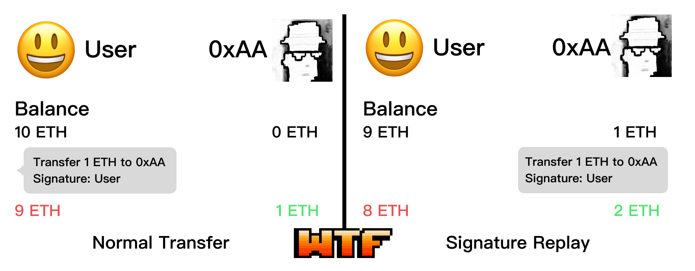

# WTF Solidity Contratos Seguros: S06. Replay de Assinatura

Recentemente, tenho estudado solidity novamente para revisar alguns detalhes e escrever um "Guia WTF de Introdução ao Solidity" para iniciantes (programadores experientes podem procurar outros tutoriais). Serão lançadas de 1 a 3 aulas por semana.

Twitter: [@0xAA_Science](https://twitter.com/0xAA_Science)｜[@WTFAcademy_](https://twitter.com/WTFAcademy_)

Comunidade: [Discord](https://discord.gg/5akcruXrsk)｜[Grupo do WeChat](https://docs.google.com/forms/d/e/1FAIpQLSe4KGT8Sh6sJ7hedQRuIYirOoZK_85miz3dw7vA1-YjodgJ-A/viewform?usp=sf_link)｜[Site oficial wtf.academy](https://wtf.academy)

Todo o código e tutoriais estão disponíveis no GitHub: [github.com/AmazingAng/WTFSolidity](https://github.com/AmazingAng/WTFSolidity)

-----

Nesta aula, vamos abordar o ataque de replay de assinatura em contratos inteligentes e métodos de prevenção. Esse tipo de ataque indiretamente levou ao roubo de 20 milhões de tokens $OP da famosa empresa de market making Wintermute.

## Replay de Assinatura

Quando eu estava na escola, os professores costumavam pedir para os pais assinarem algumas coisas, e às vezes, quando meus pais estavam ocupados, eu "gentilmente" copiava a assinatura deles. De certa forma, isso é um replay de assinatura.

No blockchain, assinaturas digitais podem ser usadas para identificar o signatário dos dados e verificar a integridade dos dados. Ao enviar uma transação, o usuário assina a transação com sua chave privada, permitindo que outras pessoas verifiquem que a transação foi enviada pela conta correspondente. Os contratos inteligentes também podem usar o algoritmo `ECDSA` para verificar assinaturas criadas off-chain pelos usuários e, em seguida, executar lógicas como minting ou transferência de tokens. Para mais informações sobre assinaturas digitais, consulte a [Aula 37 do WTF Solidity: Assinaturas Digitais](../37_Signature/readme.md).

Existem dois tipos comuns de ataques de replay de assinatura:

1. Replay comum: reutilização de uma assinatura que deveria ser usada apenas uma vez. A série de NFTs "The Association" lançada pela NBA foi mintada gratuitamente devido a esse tipo de ataque.
2. Replay entre blockchains: reutilização de uma assinatura que deveria ser usada em uma blockchain em outra blockchain. A Wintermute, uma empresa de market making, teve 20 milhões de tokens $OP roubados devido a esse tipo de ataque.



## Exemplo de Contrato Vulnerável

O contrato `SigReplay` abaixo é um contrato de token ERC20 que possui uma vulnerabilidade de replay de assinatura em sua função de minting. Ele usa assinaturas off-chain para permitir que um endereço na lista branca `to` minte uma quantidade correspondente de tokens. O contrato armazena o endereço do `signer` para verificar se a assinatura é válida.

```solidity
// SPDX-License-Identifier: MIT
pragma solidity ^0.8.4;

import "@openzeppelin/contracts/token/ERC20/ERC20.sol";
import "@openzeppelin/contracts/access/Ownable.sol";
import "@openzeppelin/contracts/utils/cryptography/ECDSA.sol";

// Exemplo de erro de gerenciamento de permissões
contract SigReplay is ERC20 {

    address public signer;

    // Construtor: inicializa o nome e o símbolo do token
    constructor() ERC20("SigReplay", "Replay") {
        signer = msg.sender;
    }
    
    /**
     * Função de minting com vulnerabilidade de replay de assinatura
     * to: 0x5B38Da6a701c568545dCfcB03FcB875f56beddC4
     * amount: 1000
     * Assinatura: 0x5a4f1ad4d8bd6b5582e658087633230d9810a0b7b8afa791e3f94cc38947f6cb1069519caf5bba7b975df29cbfdb4ada355027589a989435bf88e825841452f61b
     */
    function badMint(address to, uint amount, bytes memory signature) public {
        bytes32 _msgHash = toEthSignedMessageHash(getMessageHash(to, amount));
        require(verify(_msgHash, signature), "Invalid Signer!");
        _mint(to, amount);
    }

    /**
     * Concatena o endereço `to` (tipo address) e o `amount` (tipo uint256) para formar a mensagem msgHash
     * to: 0x5B38Da6a701c568545dCfcB03FcB875f56beddC4
     * amount: 1000
     * msgHash correspondente: 0xb4a4ba10fbd6886a312ec31c54137f5714ddc0e93274da8746a36d2fa96768be
     */
    function getMessageHash(address to, uint256 amount) public pure returns(bytes32){
        return keccak256(abi.encodePacked(to, amount));
    }

    /**
     * @dev Obtém a mensagem assinada do Ethereum
     * `hash`: hash da mensagem
     * Segue o padrão de assinatura do Ethereum: https://eth.wiki/json-rpc/API#eth_sign[`eth_sign`]
     * e `EIP191`: https://eips.ethereum.org/EIPS/eip-191`
     * Adiciona o campo "\x19Ethereum Signed Message:\n32" para evitar que a assinatura seja usada em transações executáveis.
     */
    function toEthSignedMessageHash(bytes32 hash) public pure returns (bytes32) {
        // 32 é o tamanho em bytes do hash,
        // conforme especificado na assinatura de tipo acima
        return keccak256(abi.encodePacked("\x19Ethereum Signed Message:\n32", hash));
    }

    // Verificação ECDSA
    function verify(bytes32 _msgHash, bytes memory _signature) public view returns (bool){
        return ECDSA.recover(_msgHash, _signature) == signer;
    }
```

**Observação:** A função de minting `badMint()` não verifica se a assinatura já foi usada, permitindo que a mesma assinatura seja usada várias vezes para mintar tokens indefinidamente.

```solidity
    function badMint(address to, uint amount, bytes memory signature) public {
        bytes32 _msgHash = toEthSignedMessageHash(keccak256(abi.encodePacked(to, amount)));
        require(verify(_msgHash, signature), "Invalid Signer!");
        _mint(to, amount);
    }
```

## Reproduzindo no `Remix`

**1.** Implante o contrato `SigReplay`, o endereço do signatário `signer` será inicializado com o endereço da carteira que implantou o contrato.


**2.** Use a função `getMessageHash` para obter a mensagem.


**3.** Clique no botão de assinatura no painel de implantação do Remix e assine a mensagem com a chave privada.


**4.** Chame repetidamente a função `badMint` para realizar um ataque de replay de assinatura e mintar uma grande quantidade de tokens.


## Métodos de Prevenção

Existem duas principais formas de prevenir ataques de replay de assinatura:

1. Registrar as assinaturas usadas anteriormente, por exemplo, registrando os endereços que já mintaram tokens na variável `mintedAddress`, para evitar que a mesma assinatura seja usada novamente:

    ```solidity
    mapping(address => bool) public mintedAddress;   // Registra os endereços que já mintaram
    
    function goodMint(address to, uint amount, bytes memory signature) public {
        bytes32 _msgHash = toEthSignedMessageHash(getMessageHash(to, amount));
        require(verify(_msgHash, signature), "Invalid Signer!");
        // Verifica se o endereço já mintou tokens
        require(!mintedAddress[to], "Already minted");
        // Registra o endereço que mintou tokens
        mintedAddress[to] = true;
        _mint(to, amount);
    }
    ```

2. Incluir um `nonce` (um número que aumenta a cada transação) e o `chainid` (ID da blockchain) na mensagem assinada, para evitar ataques de replay comuns e entre blockchains:

    ```solidity
    uint nonce;

    function nonceMint(address to, uint amount, bytes memory signature) public {
        bytes32 _msgHash = toEthSignedMessageHash(keccak256(abi.encodePacked(to, amount, nonce, block.chainid)));
        require(verify(_msgHash, signature), "Invalid Signer!");
        _mint(to, amount);
        nonce++;
    }
    ```

## Conclusão

Nesta aula, abordamos a vulnerabilidade de replay de assinatura em contratos inteligentes e apresentamos duas formas de prevenção:

1. Registrar as assinaturas usadas anteriormente para evitar o uso repetido.

2. Incluir um `nonce` e o `chainid` na mensagem assinada.

<!-- This file was translated using AI by repo_ai_translate. For more information, visit https://github.com/marcelojsilva/repo_ai_translate -->