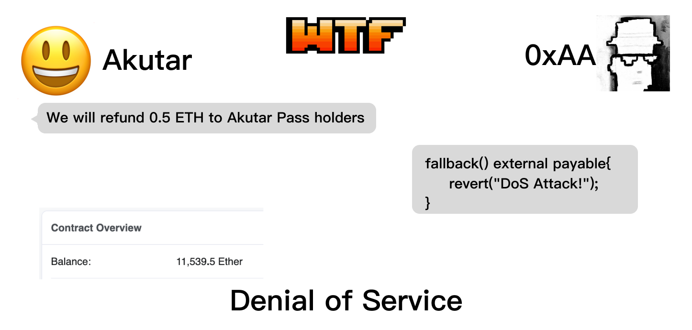
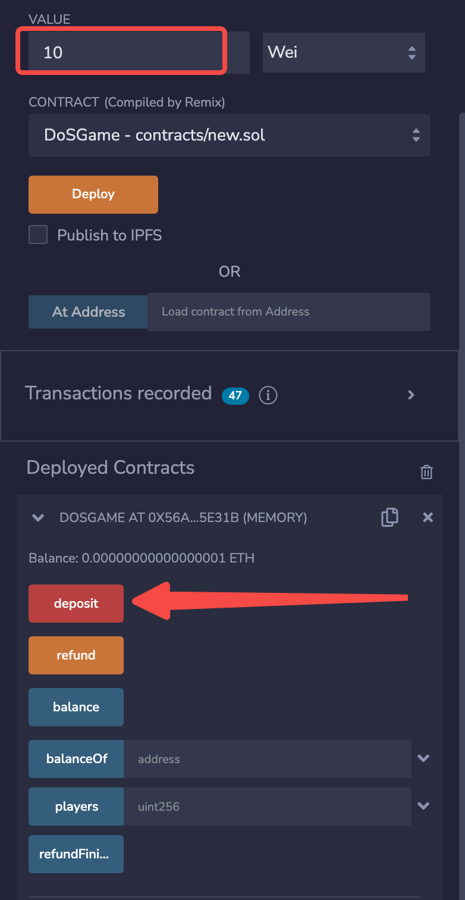

# Segurança de Contratos Inteligentes, WTF Solidity: S09. Negando Serviço

Recentemente, eu tenho revisado meus conhecimentos em solidity para consolidar detalhes sobre a linguagem e criar um guia "WTF Solidity: Introdução Básica" para pessoas iniciantes (esse guia não é para pessoas que já são especialistas em programação). Serão lançadas de 1 a 3 lições por semana.

Twitter: [@0xAA_Science](https://twitter.com/0xAA_Science)｜[@WTFAcademy_](https://twitter.com/WTFAcademy_)

Comunidade: [Discord](https://discord.gg/5akcruXrsk)｜[Grupo WeChat](https://docs.google.com/forms/d/e/1FAIpQLSe4KGT8Sh6sJ7hedQRuIYirOoZK_85miz3dw7vA1-YjodgJ-A/viewform?usp=sf_link)｜[Website wtf.academy](https://wtf.academy)

Todo o código e os tutoriais estão disponíveis no GitHub: [github.com/AmazingAng/WTFSolidity](https://github.com/AmazingAng/WTF-Solidity)

---

Nesta lição, vamos discutir a vulnerabilidade de negação de serviço (DoS) em contratos inteligentes e abordar maneiras de evitar esse tipo de problema. O projeto de NFTs Akutar perdeu 11.539 ETH, o que correspondia a aproximadamente 34 milhões de dólares na época, devido a um bug de DoS.

## DoS

No contexto da Web 2.0, um ataque de negação de serviço (DoS) ocorre quando um servidor é interrompido e não consegue fornecer serviços aos usuários legítimos devido ao envio de grande volume de lixo de informações ou interferências de informações pelo atacante. No Web3, uma DoS em contrato inteligente ocorre quando uma vulnerabilidade é explorada de forma que o contrato não consiga funcionar corretamente.

Em abril de 2022, um projeto de NFT chamado Akutar utilizou um leilão holandês para distribuição de tokens e arrecadou 11.539,5 ETH, tornando-se um grande sucesso. Anteriormente, os participantes da comunidade que possuíam o "Pass" desse projeto deveriam receber 0,5 ETH de reembolso. No entanto, quando eles tentaram processar os reembolsos, descobriram que o contrato inteligente tinha um bug de negação de serviço e todos os fundos ficaram presos. O contrato do Akutar tinha uma vulnerabilidade de DoS.



## Exemplo de Vulnerabilidade

Abaixo, vamos examinar um contrato chamado `DoSGame` que representa uma versão simplificada do contrato do Akutar. A lógica desse contrato é bastante simples: quando o jogo começa, os jogadores fazem chamadas à função `deposit()` para depositar seus tokens ETH e o contrato registra seus endereços e saldos correspondentes. Quando o jogo termina, a função `refund()` é chamada para reembolsar os jogadores com seus ETH.

```solidity
// SPDX-License-Identifier: MIT
pragma solidity ^0.8.4;

// Jogo com vulnerabilidade de DoS - os jogadores fazem depósitos e, quando o jogo termina, recebem seus reembolsos
contract DoSGame {
    bool public refundFinished;
    mapping(address => uint256) public balanceOf;
    address[] public players;

    // Todos os jogadores fazem depósitos no contrato
    function deposit() external payable {
        require(!refundFinished, "Game Over");
        require(msg.value > 0, "Please donate ETH");
        // Registra o saldo do jogador
        balanceOf[msg.sender] = msg.value;
        // Registra os endereços dos jogadores
        players.push(msg.sender);
    }

    // O jogo termina, os reembolsos começam a ser processados sequencialmente
    function refund() external {
        require(!refundFinished, "Game Over");
        uint256 pLength = players.length;
        // Reembolsa todos os jogadores em um loop
        for(uint256 i; i < pLength; i++){
            address player = players[i];
            uint256 refundETH = balanceOf[player];
            (bool success, ) = player.call{value: refundETH}("");
            require(success, "Refund Fail!");
            balanceOf[player] = 0;
        }
        refundFinished = true;
    }

    function balance() external view returns(uint256){
        return address(this).balance;
    }
}
```

O bug nesse contrato está na função `refund()`. Quando os reembolsos são processados sequencialmente em um loop e a função `call` é utilizada para transferir os ETHs de volta para os jogadores, isso permite que um endereço malicioso execute algum código mal-intencionado em seu contrato durante esse processo.

```
(bool success, ) = player.call{value: refundETH}("");
```

Em seguida, escrevemos um contrato de ataque em que a função `attack()` permite que o endereço malicioso faça um depósito e participe do jogo. A função `fallback()` é uma função de retorno que rejeita todas as transações enviadas para o contrato, atacando a vulnerabilidade de DoS do contrato `DoSGame`. Isso ocorre porque a sequência de reembolsos não pode ser executada corretamente e os fundos ficarão presos no contrato, assim como os mais de 10.000 ETHs no contrato Akutar.

```solidity
contract Attack {
    // Ataque DoS quando os reembolsos são processados
    fallback() external payable{
        revert("DoS Attack!");
    }

    // Participa do jogo DoS e faz um depósito
    function attack(address gameAddr) external payable {
        DoSGame dos = DoSGame(gameAddr);
        dos.deposit{value: msg.value}();
    }
}
```

## Reprodução no Remix

**1.** Implante o contrato `DoSGame`.
**2.** Chame a função `deposit()` do contrato `DoSGame` para depositar e participar do jogo.

**3.** Neste ponto, se você chamar a função `refund()` do contrato `DoSGame`, você receberá um reembolso normalmente.
！[](./img/S09-3.jpg)
**4.** Implante novamente o contrato `DoSGame` e implante o contrato `Attack`.
**5.** Chame a função `attack()` do contrato `Attack` para fazer um depósito e participar do jogo.
！[](./img/S09-4.jpg)
**6.** Chame a função `refund()` do contrato `DoSGame` para receber um reembolso e descubra que a transação não é bem sucedida, pois o ataque teve êxito.
！[](./img/S09-5.jpg)

## Medidas Preventivas

Vários erros lógicos podem levar a um DoS em um contrato inteligente, portanto, os desenvolvedores devem ter muito cuidado ao escrever contratos. Abaixo estão algumas áreas que requerem especial atenção:

1. Falhas na chamada de funções de contratos externos (por exemplo, `call`) não devem bloquear recursos importantes. Por exemplo, é possível remover a linha `require(success, "Refund Fail!");` do contrato que possui a falha para que o reembolso se prossiga mesmo se uma única transação falhar.
2. O contrato não deve se auto-destruir inesperadamente.
3. O contrato não deve entrar em loops infinitos.
4. Os parâmetros das funções `require` e `assert` devem ser definidos corretamente.
5. No processo de reembolso, é recomendável permitir que os usuários retirem os fundos por conta própria (push), em vez de realizar um envio em massa de fundos (pull).
6. Verifique se as funções de retorno (fallback) não afetam o funcionamento normal do contrato.
7. Certifique-se de que as principais funcionalidades do contrato ainda possam ser executadas mesmo que o envolvimento dos participantes (como o `owner`) nunca aconteça.

## Conclusão

Nesta lição, falamos sobre a vulnerabilidade de negação de serviço em contratos inteligentes. O projeto Akutar perdeu mais de 10.000 ETHs devido a essa vulnerabilidade. Vários erros lógicos podem levar a DoS, então os desenvolvedores precisam ter muito cuidado ao escrever contratos inteligentes, como permitir que os usuários cliem os seus próprios reembolsos ao invés de realizar um envio em massa de fundos para eles.

