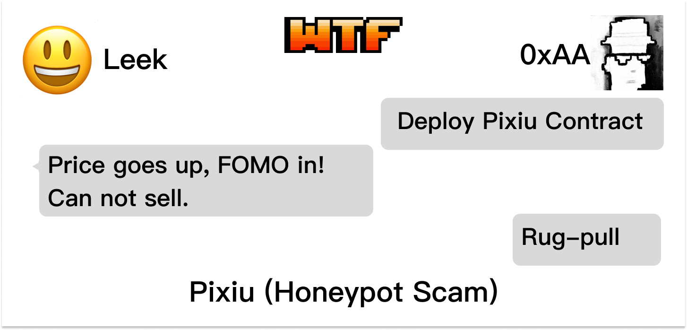

# S10. Pixiu

Eu recentemente tenho estado revisando sólidos, consolidando detalhes, e escrevendo um "Guia Simplificado de Solidity" para iniciantes (programadores avançados podem procurar outros tutoriais), com atualizações semanais de 1-3 lições.

Twitter: [@0xAA_Science](https://twitter.com/0xAA_Science) | [@WTFAcademy_](https://twitter.com/WTFAcademy_)

Comunidade: [Discord](https://discord.gg/5akcruXrsk) | [Grupo no WhatsApp](https://docs.google.com/forms/d/e/1FAIpQLSe4KGT8Sh6sJ7hedQRuIYirOoZK_85miz3dw7vA1-YjodgJ-A/viewform?usp=sf_link) | [Site oficial wtf.academy](https://wtf.academy)

Todo o código e tutoriais estão disponíveis no GitHub: [github.com/AmazingAng/WTF-Solidity](https://github.com/AmazingAng/WTF-Solidity)

---

Nesta lição, vamos falar sobre contratos Pixiu e métodos de prevenção (também conhecidos como tokens de armadilha honeypot).

## Introdução ao Pixiu

[Pixiu](https://en.wikipedia.org/wiki/Pixiu) é uma criatura mítica chinesa conhecida por sua capacidade de atrair riqueza. Porém, no mundo da Web3, Pixiu é visto como uma criatura maléfica, um inimigo dos investidores ingênuos. Um contrato Pixiu possui a característica de permitir apenas a compra de tokens, sem a possibilidade de venda pelos investidores, sendo restrita apenas ao endereço do projeto.

Normalmente, um contrato Pixiu segue o ciclo de vida a seguir:

1. O projeto malicioso implanta o contrato de token Pixiu.
2. O token Pixiu é divulgado para atrair investidores, uma vez que só é possível comprar e não vender os tokens, o preço dos tokens aumenta constantemente.
3. O projeto realiza um "rug pull", sacando todo o dinheiro investido.



Compreender os princípios por trás dos contratos Pixiu é essencial para identificá-los e evitar ser vítima deles.

## Contrato Pixiu

Aqui, apresentamos um contrato ERC20 Pixiu token extremamente simples. Neste contrato, apenas o proprietário pode vender os tokens no Uniswap, outros endereços não conseguem realizar essa operação.

O contrato Pixiu tem uma variável de estado `pair` que registra o endereço do par de tokens `Pixiu-ETH LP` no Uniswap. Ele possui três funções principais:

1. Construtor: Inicializa o nome e o símbolo do token e calcula o endereço do contrato LP com base nos princípios do Uniswap e do create2. Este endereço será usado na função `_update()`.
2. `mint()`: Função de criação de tokens, que só pode ser chamada pelo proprietário e é utilizada para criar tokens Pixiu.
3. `_update()`: Função chamada antes de uma transferência de token ERC20. Nela, limitamos a transferência de tokens para o endereço `LP`, ou seja, durante a venda dos tokens, a transação é revertida; apenas o chamador é o `owner`. Este é o ponto central do contrato Pixiu.

```solidity
// Contrato simples Pixiu ERC20, apenas compra, sem venda
contrato HoneyPot é ERC20, Ownable {
    address público par;

    // Construtor: inicializa o nome e o símbolo do token
    constructor() ERC20("HoneyPot", "Pi Xiu") {
        address factory = 0x5C69bEe701ef814a2B6a3EDD4B1652CB9cc5aA6f; // goerli uniswap v2 factory
        address tokenA = address(this); // endereço do token Pixiu
        address tokenB = 0xB4FBF271143F4FBf7B91A5ded31805e42b2208d6; //  goerli WETH
        (address token0, address token1) = tokenA < tokenB ? (tokenA, tokenB) : (tokenB, tokenA); //ordenar os tokens A e B
        bytes32 salt = keccak256(abi.encodePacked(token0, token1));
        // calcular o endereço do par
        pair = address(uint160(uint(keccak256(abi.encodePacked(
        hex'ff',
        factory,
        salt,
        hex'96e8ac4277198ff8b6f785478aa9a39f403cb768dd02cbee326c3e7da348845f'
        )))));
    }
    
    /**
     * Função de criação de tokens, apenas o proprietário pode chamar
     */
    function mint(address to, uint amount) public onlyOwner {
        _mint(to, amount);
    }

    /**
     * @dev Ver {ERC20-_update}.
     * Função Pixiu: apenas o proprietário pode vender
    */
    function _update(
      address from,
      address to,
      uint256 amount
  ) internal virtual override {
     if(to == pair){
        require(from == owner(), "Não é possível transferir");
      }
      super._update(from, to, amount);
  }
}
```

## Reprodução no `Remix`

Vamos implantar o contrato Pixiu na rede de testes `Goerli` e demonstrar sua funcionalidade na exchange Uniswap.

1. Implantar o contrato Pixiu.
2. Chamar a função `mint()` para criar `100000` tokens Pixiu para si mesmo.
3. Acessar o [Uniswap](https://app.uniswap.org/#/add/v2/ETH) e fornecer liquidez para o token Pixiu (v2), inserindo `10000` tokens Pixiu e `0.1` ETH.
4. Vender `100` tokens Pixiu, a operação é bem-sucedida.
5. Troque para outra conta, compre 0,01 ETH em tokens Pixiu, a operação é bem-sucedida.
6. Tentar vender os tokens Pixiu sem sucesso.

## Possíveis Disfarces

Para evitar a detecção de contratos Pixiu, algumas medidas de disfarce podem ser tomadas:

1. Por exemplo, para as transferências de usuários não privilegiados, o contrato não reverte a transação, apenas mantém o estado inalterado, aparentando que a transação foi bem-sucedida, quando na verdade não atendeu ao objetivo real do usuário.

2. Emitir eventos de erro falsos, por meio de eventos fraudulentos, a fim de desorientar as carteiras e navegadores que estão monitorando, levando a interpretações erradas pelos usuários.

## Métodos de Prevenção

Os tokens Pixiu são uma das fraudes mais comuns que os investidores enfrentam no mundo cripto, apresentando diversas formas. Para minimizar o risco de ser vítima de um contrato Pixiu, aqui estão algumas sugestões:

1. Verificar se o contrato é de código aberto em um explorador de blockchain (por exemplo, [etherscan](https://etherscan.io/)), e se é, analisar o código em busca de vulnerabilidades.

2. Caso não tenha habilidades de programação, utilizar ferramentas de identificação de contratos Pixiu, como [Token Sniffer](https://tokensniffer.com/) e [Ave Check](https://ave.ai/check), contratos de baixa qualidade provavelmente são Pixiu.

3. Verificar se existe um relatório de auditoria do projeto.

4. Analisar cuidadosamente o site e as redes sociais do projeto.

5. Invista apenas em projetos que você conheça bem, faça sua própria pesquisa (DYOR).

## Conclusão

Nesta lição, abordamos contratos Pixiu e métodos para evitar cair em armadilhas Pixiu. Os contratos Pixiu são uma das adversidades mais comuns que investidores enfrentam no mundo cripto, sendo bastante odiados. Recentemente, também surgiram Pixiu NFTs, onde projetos maliciosos alteram as funções de transferência ou autorização do ERC721 para impedir que os investidores vendam. Compreender os princípios dos contratos Pixiu e as medidas de prevenção pode reduzir significativamente a probabilidade de adquirir um contrato Pixiu, tornando seus fundos mais seguros. Mantenha-se sempre aprendendo.

<!-- This file was translated using AI by repo_ai_translate. For more information, visit https://github.com/marcelojsilva/repo_ai_translate -->