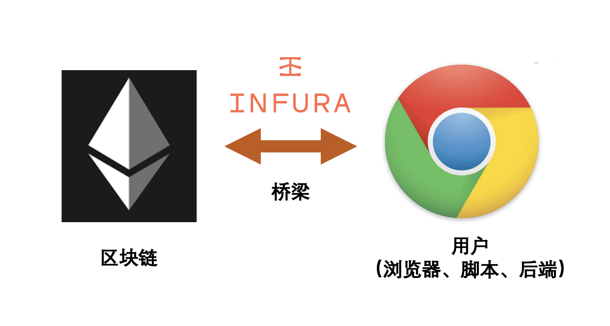
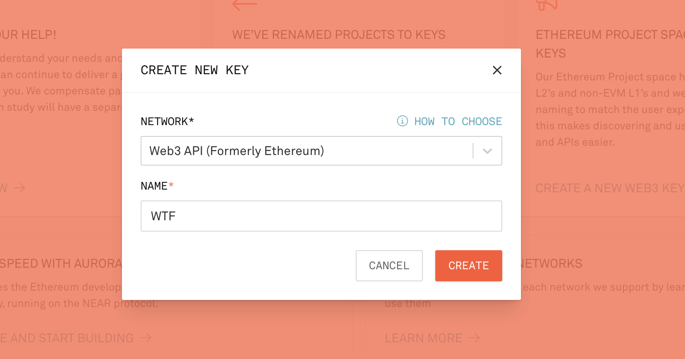

# WTF Solidity极简入门-工具篇2：Infura, 连接链下与链上的桥梁

Eu recentemente comecei a estudar solidity novamente, revisando os detalhes e escrevendo um "Guia WTF Solidity para Iniciantes", para ajudar os novatos. Serão lançadas de 1 a 3 aulas por semana.

Siga-me no Twitter: [@0xAA_Science](https://twitter.com/0xAA_Science)

Comunidade técnica WTF no Discord, com informações sobre como entrar no grupo do WeChat: [link](https://discord.gg/5akcruXrsk)

Todo o código e tutoriais estão disponíveis no GitHub: [github.com/AmazingAng/WTFSolidity](https://github.com/AmazingAng/WTFSolidity)

-----
`Infura` é uma infraestrutura de blockchain desenvolvida pela Consensys (empresa-mãe da carteira MetaMask) que ajuda os usuários/desenvolvedores a interagirem melhor com a blockchain Ethereum.

## Conectando aplicativos e a blockchain



Os aplicativos Dapp desenvolvidos na Ethereum (off-chain) precisam interagir com a blockchain (on-chain). No início, havia pouca infraestrutura na Ethereum, então os desenvolvedores precisavam implantar um nó Ethereum localmente para realizar a interação entre off-chain e on-chain, o que era muito complicado e demorava vários dias.

O Infura construiu uma ponte entre off-chain e on-chain, tornando a interação entre os dois mais simples. Ele fornece acesso instantâneo e escalável à API do Ethereum e da rede IPFS. Após se registrar no site do Infura, os desenvolvedores podem solicitar gratuitamente uma chave de API Ethereum e usar os nós do Infura para interagir com a blockchain. Além disso, a carteira MetaMask possui o serviço do Infura integrado, facilitando o acesso à rede Ethereum para os usuários.

## Criando uma chave de API do Infura

### 1. Abra o site do Infura e faça o registro

URL: [infura.io](https://infura.io)


### 2. Crie uma chave de API
Após se registrar, acesse o painel de controle (Dashboard) e clique no botão **CREATE NEW KEY** no canto superior direito.


### 3. Preencha as informações da chave de API

Selecione **Web3 API (Formerly Ethereum)** em `NETWORK`, ou em algumas versões pode aparecer apenas **Ethereum**. Preencha o campo `NAME` com qualquer nome, como "WTF", e clique no botão **CREATE**.



### 4. Chave de API criada

Volte para o painel de controle (Dashboard) e você verá que a chave de API chamada "WTF" foi criada. Clique no botão **MANAGE KEY** para ver os detalhes da chave de API.


### 5. Ver detalhes da chave de API

Na página de detalhes da chave de API, você encontrará a sua chave de API (um conjunto de chaves que começa com "184d" na imagem). Na seção **NETWORK ENDPOINT** abaixo, você encontrará o link para o nó RPC da mainnet ou testnet da Ethereum, que pode ser usado para acessar e interagir com os dados da blockchain. Além disso, você pode solicitar nós RPC Layer2 gratuitos, como Polygon, Optimism e Arbitrum, mas é necessário vincular um cartão de crédito Visa. Durante o airdrop do Optimism, os nós RPC públicos ficaram congestionados, mas as pessoas que usavam nós RPC privados do Infura puderam receber normalmente.


## Usando a chave de API do Infura
### JavaScript (`ethers.js`)
No `ethers.js`, você pode usar a chave de API do Infura para criar um `JsonRpcProvider` e interagir com a blockchain.

```javascript
const { ethers } = require("ethers");
// Insira sua chave de API do Infura
const INFURA_ID = '' 
const provider = new ethers.providers.JsonRpcProvider(`https://mainnet.infura.io/v3/${INFURA_ID}`)
```

### Carteira MetaMask

Acesse as configurações da carteira MetaMask, vá para a página de **Setting**, clique em **Network** e depois em **Add Network**. Você pode adicionar a rede Layer2 do Optimism no MetaMask usando os seguintes parâmetros:

```
Nome da rede (Network Name): Optimism
URL RPC: insira o link RPC do Optimism que você solicitou no Infura
ID da rede (Chain ID): 10
Símbolo da rede (Chain Symbol): ETH
URL do explorador de blockchain (Blockchain Explorer URL): https://optimistic.etherscan.io
```


## Conclusão

Nesta aula, aprendemos como criar e usar uma chave de API do Infura para acessar a blockchain Ethereum de forma conveniente.

<!-- This file was translated using AI by repo_ai_translate. For more information, visit https://github.com/marcelojsilva/repo_ai_translate -->