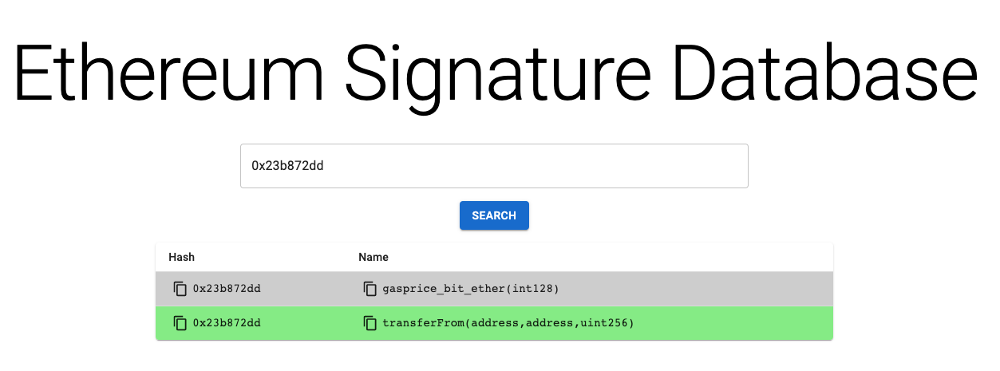

# WTF Solidity 合约安全: S02. 选择器碰撞

我最近在重新学solidity，巩固一下细节，也写一个“WTF Solidity极简入门”，供小白们使用（编程大佬可以另找教程），每周更新1-3讲。

推特：[@0xAA_Science](https://twitter.com/0xAA_Science)

社区：[Discord](https://discord.wtf.academy)｜[微信群](https://docs.google.com/forms/d/e/1FAIpQLSe4KGT8Sh6sJ7hedQRuIYirOoZK_85miz3dw7vA1-YjodgJ-A/viewform?usp=sf_link)｜[官网 wtf.academy](https://wtf.academy)

所有代码和教程开源在github: [github.com/AmazingAng/WTFSolidity](https://github.com/AmazingAng/WTFSolidity)

-----

这一讲，我们将介绍选择器碰撞攻击，它是导致跨链桥 Poly Network 被黑的原因之一。在2021年8月，Poly Network在ETH，BSC，和Polygon上的跨链桥合约被盗，损失高达6.11亿美元（[总结](https://rekt.news/zh/polynetwork-rekt/)）。这是2021年最大的区块链黑客事件，也是历史被盗金额榜单上第2名，仅次于 Ronin 桥黑客事件。

## 选择器碰撞

以太坊智能合约中，函数选择器是函数签名 `"<function name>(<function input types>)"` 的哈希值的前`4`个字节（`8`位十六进制）。当用户调用合约的函数时，`calldata`的前`4`字节就是目标函数的选择器，决定了调用哪个函数。如果你不了解它，可以阅读[WTF Solidity极简教程第29讲：函数选择器](https://github.com/AmazingAng/WTFSolidity/blob/main/29_Selector/readme.md)。

由于函数选择器只有`4`字节，非常短，很容易被碰撞出来：即我们很容易找到两个不同的函数，但是他们有着相同的函数选择器。比如`transferFrom(address,address,uint256)`和`gasprice_bit_ether(int128)`有着相同的选择器：`0x23b872dd`。当然你也可以写个脚本暴力破解。



大家可以用这两个网站来查同一个选择器对应的不同函数：

1. https://www.4byte.directory/
2. https://sig.eth.samczsun.com/

你也可以使用下面的`Power Clash`工具进行暴力破解：

1. PowerClash: https://github.com/AmazingAng/power-clash

相比之下，钱包的公钥有`256`字节，被碰撞出来的概率几乎为`0`，非常安全。

## `0xAA` 解决斯芬克斯之谜

以太坊的人得罪了天神，天神震怒。天后赫拉为了惩罚以太坊的人，在以太坊的峭崖上降下一个名叫斯芬克斯的人面狮身的女妖。她向每一个路过悬崖的以太坊用户提出一个谜语：“什么东西在早晨用四只脚走路，中午两只脚走路，晚间三只脚走路，在一切生物中这是唯一的用不同数目的脚走路的生物。脚最多的时候，正是速度和力量最小的时候。”对于这个奥妙费解的谜语，凡猜中者即可活命，凡猜不中者一律被吃掉。过路的人全被斯芬克斯吃了，以太坊用户陷入恐惧之中。斯芬克斯用选择器`0x10cd2dc7`来验证答案是否正确。

有一天上午，俄狄浦斯路过此地，会见了女妖，并猜中了这神秘奥妙之谜。他说：“这是`"function man()"`啊！在生命的早晨，他是个孩子，用两条腿和两只手爬行；到了生命的中午，他变成壮年，只用两条腿走路；到了生命的傍晚，他年老体衰，必须借助拐杖走路，所以被称为三只脚。”谜语被猜中后，俄狄浦斯得以生还。

那一天下午，`0xAA`路过此地，会见了女妖，并猜中了这神秘奥妙之谜。他说：“这是`"function peopleLduohW(uint256)"`啊！在生命的早晨，他是个孩子，用两条腿和两只手爬行；到了生命的中午，他变成壮年，只用两条腿走路；到了生命的傍晚，他年老体衰，必须借助拐杖走路，所以被称为三只脚。”谜语再次被猜中后，斯芬克斯气急败坏，脚下一打滑就从巍峨的峭崖上掉下去摔死了。


## 漏洞合约例子

### 漏洞合约

下面我们来看一下有漏洞的合约例子。`SelectorClash`合约有`1`个状态变量 `solved`，初始化为`false`，攻击者需要将它改为`true`。合约主要有`2`个函数，函数名沿用自 Poly Network 漏洞合约。

1. `putCurEpochConPubKeyBytes()` ：攻击者调用这个函数后，就可以将`solved`改为`true`，完成攻击。但是这个函数检查`msg.sender == address(this)`，因此调用者必须为合约本身，我们需要看下其他函数。

2. `executeCrossChainTx()` ：通过它可以调用合约内的函数，但是函数参数的类型和目标函数不太一样：目标函数的参数为`(bytes)`，而这里调用的函数参数为`(bytes,bytes,uint64)`。

```solidity
contract SelectorClash {
    bool public solved; // 攻击是否成功

    // 攻击者需要调用这个函数，但是调用者 msg.sender 必须是本合约。
    function putCurEpochConPubKeyBytes(bytes memory _bytes) public {
        require(msg.sender == address(this), "Not Owner");
        solved = true;
    }

    // 有漏洞，攻击者可以通过改变 _method 变量碰撞函数选择器，调用目标函数并完成攻击。
    function executeCrossChainTx(bytes memory _method, bytes memory _bytes, bytes memory _bytes1, uint64 _num) public returns(bool success){
        (success, ) = address(this).call(abi.encodePacked(bytes4(keccak256(abi.encodePacked(_method, "(bytes,bytes,uint64)"))), abi.encode(_bytes, _bytes1, _num)));
    }
}
```

### 攻击方法

我们的目标是利用`executeCrossChainTx()`函数调用合约中的`putCurEpochConPubKeyBytes()`，目标函数的选择器为：`0x41973cd9`。观察到`executeCrossChainTx()`中是利用`_method`参数和`"(bytes,bytes,uint64)"`作为函数签名计算的选择器。因此，我们只需要选择恰当的`_method`，让这里算出的选择器等于`0x41973cd9`，通过选择器碰撞调用目标函数。

Poly Network黑客事件中，黑客碰撞出的`_method`为 `f1121318093`，即`f1121318093(bytes,bytes,uint64)`的哈希前`4`位也是`0x41973cd9`，可以成功的调用函数。接下来我们要做的就是将`f1121318093`转换为`bytes`类型：`0x6631313231333138303933`，然后作为参数输入到`executeCrossChainTx()`中。`executeCrossChainTx()`函数另`3`个参数不重要，填 `0x`, `0x`, `0` 就可以。

## `Remix`演示

1. 部署`SelectorClash`合约。
2. 调用`executeCrossChainTx()`，参数填`0x6631313231333138303933`，`0x`，`0x`，`0`，发起攻击。
3. 查看`solved`变量的值，被修改为`ture`，攻击成功。

## 总结

这一讲，我们介绍了选择器碰撞攻击，它是导致跨链桥 Poly Network 被黑 6.1 亿美金的的原因之一。这个攻击告诉了我们：

1. 函数选择器很容易被碰撞，即使改变参数类型，依然能构造出具有相同选择器的函数。

2. 管理好合约函数的权限，确保拥有特殊权限的合约的函数不能被用户调用。
