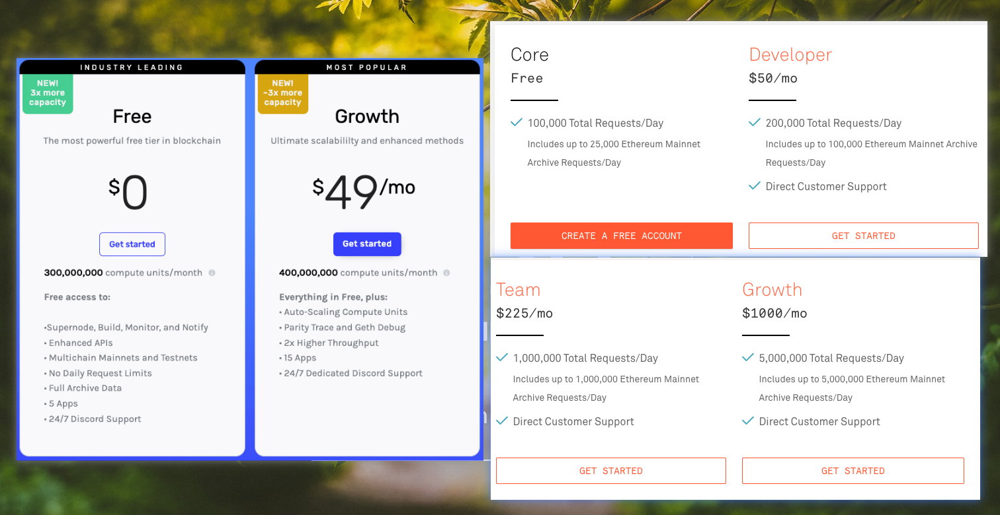
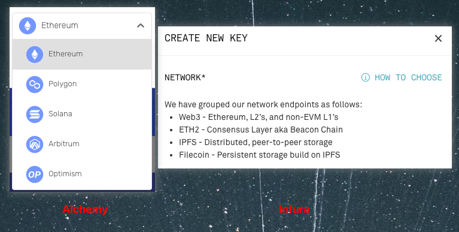
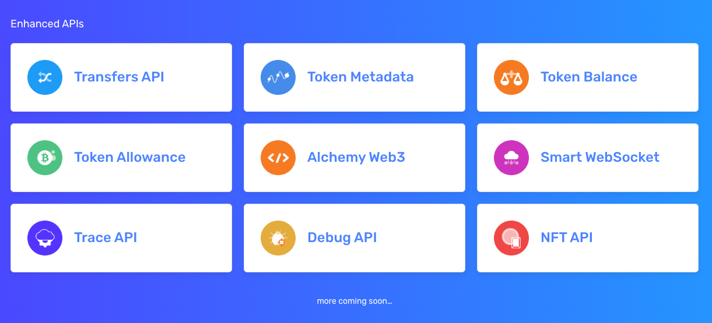
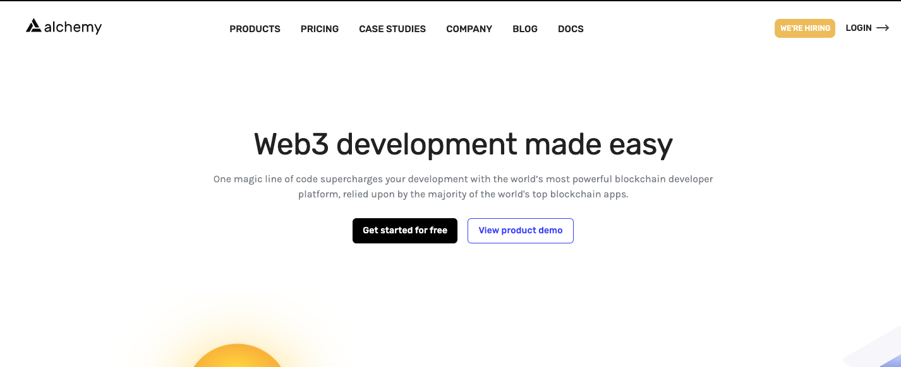
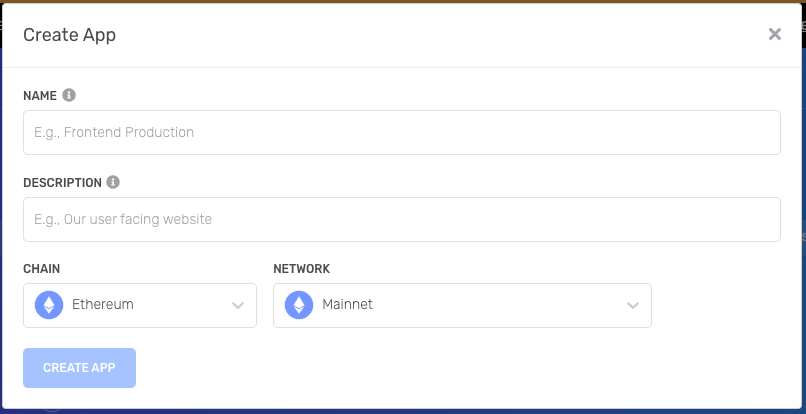
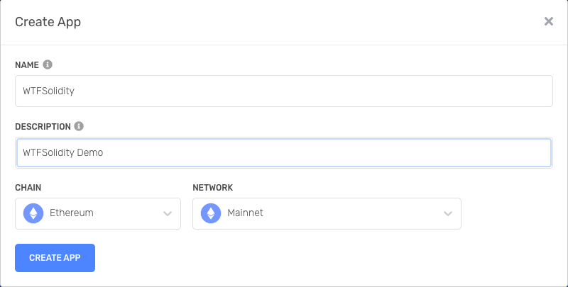
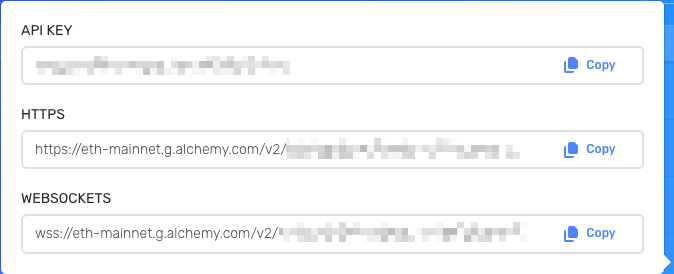
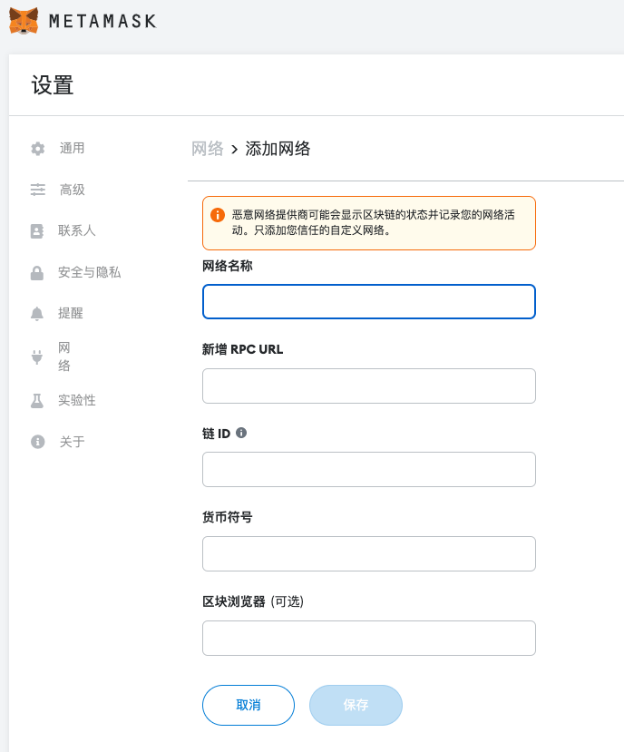

# Solidity极简入门-工具篇2：Alchemy, 连接链下与链上的桥梁

我最近在重新学solidity，巩固一下细节，也写一个“Solidity极简入门”，供小白们使用），每周更新1-3讲。

欢迎关注我的推特：[@0xAA_Science](https://twitter.com/0xAA_Science)

WTF技术社群discord，内有加微信群方法：[链接](https://discord.gg/5akcruXrsk)

所有代码和教程开源在github: [github.com/AmazingAng/WTFSolidity](https://github.com/AmazingAng/WTFSolidity)

-----
## Alchemy是什么

`Alchemy` 超级节点是 Ethereum、Polygon、Solana、Arbitrum、Optimism、Flow 和 Crypto.org 使用最广泛的区块链 API。获得节点的所有功能，包括 JSON-RPC 支持，但具有在区块链上运行世界级应用程序所需的超强可靠性、数据准确性和可扩展性。

## 连接应用和区块链

在以太坊上开发的Dapp应用（链下）需要与区块链（链上）交互。早期，以太坊上的基础设施很少，开发者需要在本地部署以太坊节点来完成链下和链上的交互，非常麻烦，且耗时数日。

`Alchemy` 和 `Infura`在链下、链上之间搭了一座桥，让两者的交互变的简单。它为用户提供对以太坊和IPFS网络的即时、可扩展的`API`访问。开发者在`Alchemy` 和 `Infura`官网注册后，就可以免费申请的以太坊`API KEY`，就可以利用它们的节点与区块链交互。另外，小狐狸`metamask`钱包内置了`Infura`服务，方便用户访问以太坊网络。

关于`Infura`的介绍，可以参考 [Solidity极简入门-工具篇2：Infura, 连接链下与链上的桥梁](https://github.com/AmazingAng/WTFSolidity/blob/main/Topics/Tools/TOOL02_Infura/readme.md)

## Alchemy 和 Infura 的区别



左边是`alchemy` 右边是 `Infura`，我们来对比下免费的套餐

### 访问量的区别

`Alchemy`每天没有访问限制，`Infura`每天有100,000的访问限制。
`Alchemy`每个月有`300,000,000`的访问量，`Infura`每个月有`3,000,000`的访问量。


### 支持公链的区别（免费版本）



`Alchemy`支持：ETH、Polygon、Solana、Arbitrum、Optimism
`Infura`支持：ETH、ETH2、IPFS、Filecoin 

### Alchemy支持enhanced-apis




Alchemy自己封装了一些web3的api，大家可以自己看文档获取更多的细节。

[Alchemy - enhanced-apis](https://dashboard.alchemyapi.io/enhanced-apis)

## 创建`Alchemy` API Key

### 1. 打开Alchemy官网并注册

网址：[alchemy.com](https://www.alchemy.com/)




### 2. 创建API Key
注册后，进入控制台Dashboard，并点击右上角的 **+ CREATE APP** 按钮。




### 3. 填写API Key信息

`CHAIN`：选择你需要的网络，如果是以太网就是 `Ethereum`。
`NETWORK`:并选择是主网还是测试网。



填写完成之后点击 `CREATE APP` 即可创建。

### 4. API Key创建完毕

回到控制台Dashboard，可以看到名为`WTFSolidity`的API Key已经创建完毕。在控制台Dashboard，点击  **view key** 按钮，可以查看API Key详情。


### 5. 查看API Key详情

可以看到我们创建好了相应的api key，最常用的https和websockets都支持。




## 使用`Alchemy` API Key 

### Javascript (`ethers.js`)
在`ether.js`中，我们可以利用`Infura` API Key来创建`JsonRpcProvider`，与链上交互。

```javascript
const { ethers } = require("ethers");
// 填上你的Infura API Key
const ALCHEMY_ID = '' 
const provider = new ethers.providers.JsonRpcProvider(`https://eth-mainnet.g.alchemy.com/v2/${ALCHEMY_ID}`)
```

### `Metamask`小狐狸钱包

进入小狐狸钱包设置 **Setting** 页面，点击网络 **Netowrk**，点击添加网络 **Add Network**。你可以利用下面的参数在小狐狸中添加`Alchemy` 的eth链：

```
网络名称（Network Name）: Alchemy-eth
RPC URL：填在alchemy申请的optimism rpc链接
链ID (Chain ID): 1
符号 (Chain Symbol): ETH
区块链浏览器URL (Blockchain Explorer URL): https://etherscan.io
```




## 总结

这一讲，我们介绍了如何创建并使用`Alchemy` API Key便捷访问以太坊区块链。