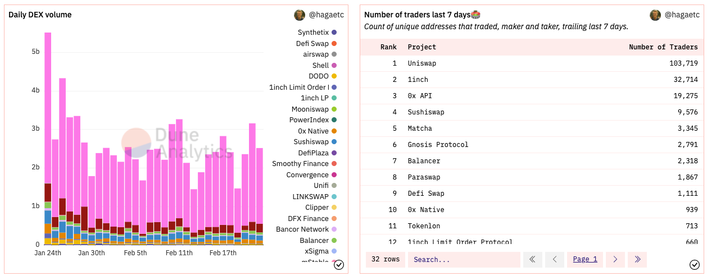
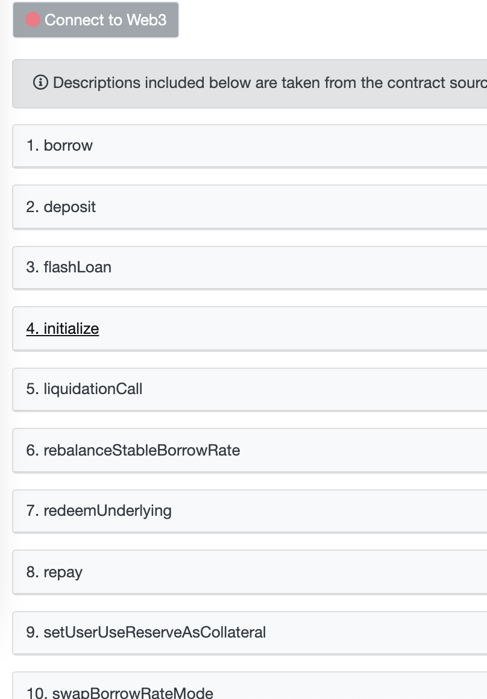
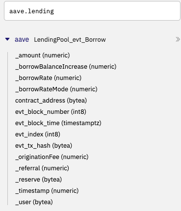
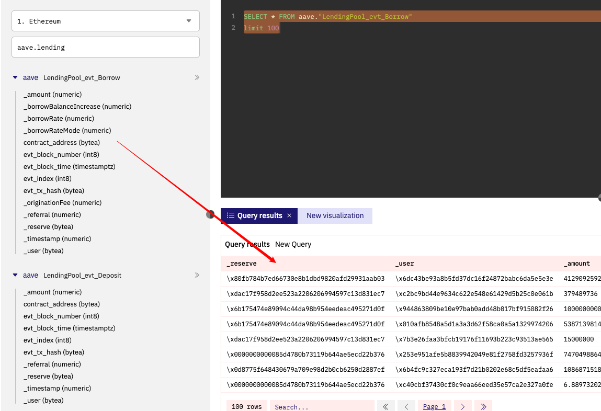
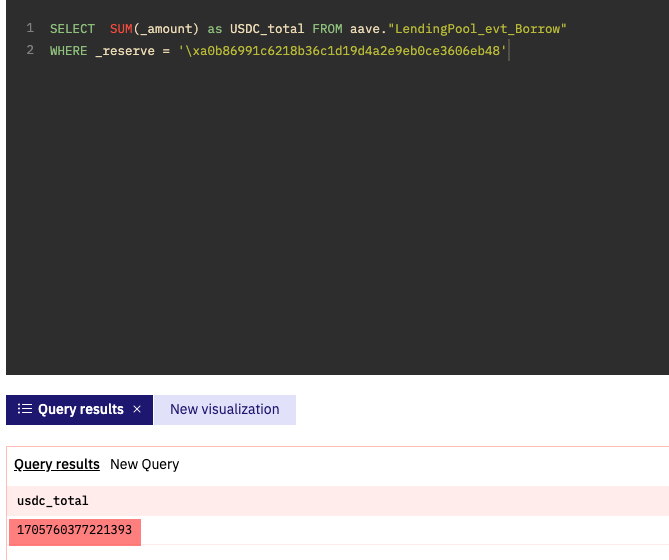

# Solidity极简入门-工具篇4：Alchemy, 区块链API和节点基础设施

我最近在重新学solidity，巩固一下细节，也写一个“Solidity极简入门”，供小白们使用），每周更新1-3讲。

欢迎关注我的推特：[@0xAA_Science](https://twitter.com/0xAA_Science)

WTF技术社群discord，内有加微信群方法：[链接](https://discord.gg/5akcruXrsk)

所有代码和教程开源在github: [github.com/AmazingAng/WTFSolidity](https://github.com/AmazingAng/WTFSolidity)

-----
## 什么是Dune

[Dune官网](https://dune.xyz/)

> Dune Analytics is a powerful tool for blockchain research. Dune gives you all the tools to query, extract, and visualize vast amounts of data from the blockchain. Dune is unlocking the power of public blockchain data by making it accessible to everyone. This documentation will help you answer questions like:


简单理解就是区块链查询分析工具，每个人可以通过写类sql语言查询区块链上的所有信息。

比如可以看一些巨鲸的数据，以及链上交易的数据等等。同时他能便捷的将数据转换为可视化的图表。





## 实践第一个查询

目标：查询**过去 24 小时在 Uniswap 上购买的 Dai**

1. 注册登陆Dune
2. 点击右上角 new query 新建查询

```sql
SELECT SUM(token_a_amount) AS dai_bought
FROM dex."trades"
WHERE block_time > now() - interval '24 hours'
AND token_a_symbol = 'DAI'
AND project = 'Uniswap'
;
```


执行查询，得到最近的24h内，通过uniswap购买了多少DAI的代币

## 实现原理

> Keep in mind, Ethereum is the **database**, smart contracts are the **data tables**, and transactions from wallets are **the rows** in each table.
>
> 以太坊是数据库，智能合约是数据表，来自钱包的交易是每个表中的行。

我觉得这句话直接讲出了区块链的精髓，区块链本质上就是消耗一定的gas，让你的数据永久的存储在分布式账本上。现在我们可以通过dune来查询这个分布式账本的数据，因为区块链它是公开的。

## 从0开始构建查询

入门学习一下如何使用和简单的语法介绍。

**目标：学会使用 SELECT, WHERE, and LIMIT**

我们把ETH EVM当作一个数据库，其中的智能合约当作一个表。

那么ETH、BSC、Polygon、solana这些都是对应的数据库，它下面的各种合约应用可以看成一个表，这张表通过各种transitions将数据链接了起来。

我们查询其中一个表，以aave为例：[aave合约](https://etherscan.io/address/0x398ec7346dcd622edc5ae82352f02be94c62d119#writeProxyContract)

通过查询aave这个合约，它有deposit（存储）这个方法，并且有该事件（事件会在执行的时候广播）。



回到Dune查找对应的表，根据在Ethereum上搜索aave相关的表，并对应事件,`LendingPool_evt_Deposit`找到该表。


### 学习：SELECT 、 LIMIT、WHERE查询数据

然后我们通过Dune可以查询对应的存储数据

```sql
SELECT * FROM aave."LendingPool_evt_Deposit"
limit 100
```


就可以得到aave合约中存储方法的相应数据，通过这个数据可以做一些筛选

#### 各个字段的意义

_user：发起存款的钱包地址
_reserve：作为抵押品存放的代币地址
_amount：存入的代币数量
_timestamp：交易被挖掘到区块链的时间戳

#### 使用 WHERE过滤数据

查询过滤特殊的地址`0xeeeeeeeeeeeeeeeeeeeeeeeeeeeeeeeeeeeeeeee`

```sql
SELECT *, (_amount / 1e18) as _amount FROM aave."LendingPool_evt_Deposit"
WHERE _reserve = '\xeeeeeeeeeeeeeeeeeeeeeeeeeeeeeeeeeeeeeeee'
limit 100
```

带上了查询条件，能够快速的筛选我们需要的数据

查看抵押品为USDC，USDC合约地址：`xa0b86991c6218b36c1d19d4a2e9eb0ce3606eb48`

```sql
SELECT * FROM aave."LendingPool_evt_Deposit"
WHERE _reserve = '\xa0b86991c6218b36c1d19d4a2e9eb0ce3606eb48'
limit 100
```


###学习 COUNT, SUM, MAX, GROUP BY, HAVING, ORDER BY

#### 了解aave."LendingPool_evt_Borrow" 表



#### 查看全表数据

```sql
SELECT * FROM aave."LendingPool_evt_Borrow"
limit 100
```



#### 使用SUM统计USDC借贷数量

```sql
SELECT  SUM(_amount) as USDC_total FROM aave."LendingPool_evt_Borrow"
WHERE _reserve = '\xa0b86991c6218b36c1d19d4a2e9eb0ce3606eb48'
```



方便的查出来借贷的数据

#### 查看最近7天USDT的借贷情况

```sql
SELECT  SUM(_amount) FROM aave."LendingPool_evt_Borrow"
WHERE "evt_block_time" > ( now() - interval '7 days') AND _reserve = '\xa0b86991c6218b36c1d19d4a2e9eb0ce3606eb48'

```

#### 使用分组查询GROUP

查看到aave有不同的`borrowRateMode`借贷利率，模式分为1和2

```sql
SELECT  "_borrowRateMode", SUM(_amount) FROM aave."LendingPool_evt_Borrow"
WHERE  _reserve = '\xa0b86991c6218b36c1d19d4a2e9eb0ce3606eb48'
GROUP BY 1
```

#### HAVING 子句

HAVING 子句可以让我们筛选分组后的各组数据。

首先我们根据用户地址，统计每个地址借贷USDC的总数量

然后再这个结果中筛选USDC历史借贷大于1000000的账号，最后根据USDC数量从大到小排序

这样一个聪明账号就可以被我们筛选出来了。

```sql
SELECT "_user", SUM(_amount) as USDC_total FROM aave."LendingPool_evt_Borrow"
WHERE _reserve = '\xa0b86991c6218b36c1d19d4a2e9eb0ce3606eb48'
GROUP BY 1
HAVING SUM(_amount) > 1000000
ORDER BY USDC_total DESC
```

### 数据可视化


点击 New visualization 就可以选择你需要的视图，比如我点击 `bar chart`


就会将我刚才筛选的数据可视化。看最长的几根，就是借贷最多的几个账号。


## 总结

以上就是dune的基础学习，通过dune能够将链上的数据转换为可视化的数据，这样我们就可以更好的了解链上的数据。
